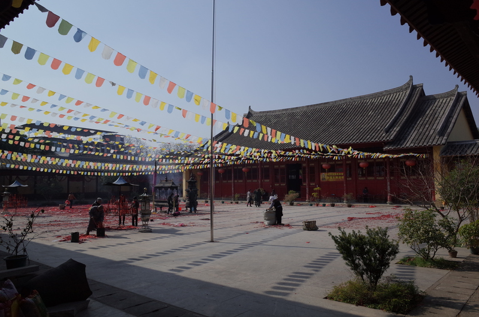

Title: Chinese New Year in Fujian
Date: 2014-03-02 22:00
Category: Traveling
Tags: Fujian
Slug: chinese-new-year-in-fujian 

I had a happy chinese new year at Fujian last month. Many of my friends are curious of what it looks like, I'll put some of my photos here to give you a glimpse of it.

JianOu (second half pronounces in English is more like Oh) is one of the old capital cities of some southern regime in Chinese history. Fujian province got its name derived from both Fuzhou(the current capital city of Fujian province) and JianOu.

Taken on the streets of Jianou on the first day of chinese new year. the slogan of the banner says 'senior's joy cultural/art assosiation', they are walking to somewhere to give the lion-dancing show.

Photos of GuangXiaoSi, a buddist temple, one of the largest temple in Jianou. A lot of people comes here during new year holiday, They light a lot of fireworks in front of the temple in order to wish a pleasent year.

The Tea Cup photo is taken during a private collection show of this temple. The Cup itself is made of a lost technic which origins from Fujian but now lost. Craftsman in both China and Japan are trying to regain this precious feat called 'JianZhan'(Jian Style), which made the supernova alike texture style on the cup.

Random shots taken on the street. The craftman is making toy figure of powder and kids loved them.

Drum Tower of JianOu, now the top building serves as a cultural/art school.

The Mark indicates the level of water during three of the worst flood in the history. The most recent one is in 1998. in that year the flood hit half of the China.

Random Shots.

A series of temple shots taken from a temple complex just outside the city streets.

Some old houses I found when wandering around the street of JianOu.
